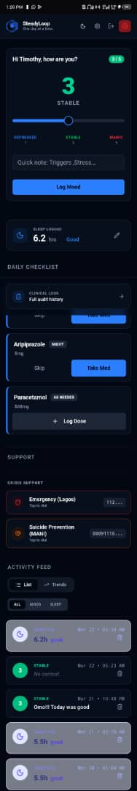
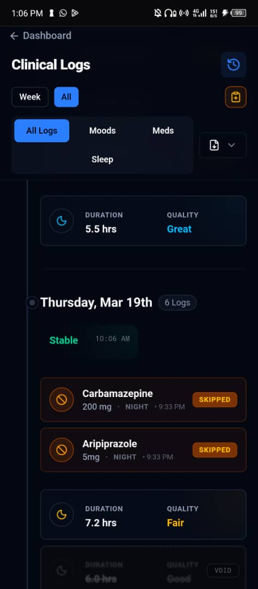
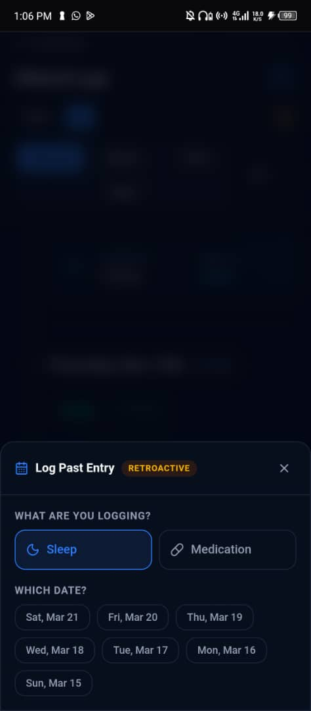
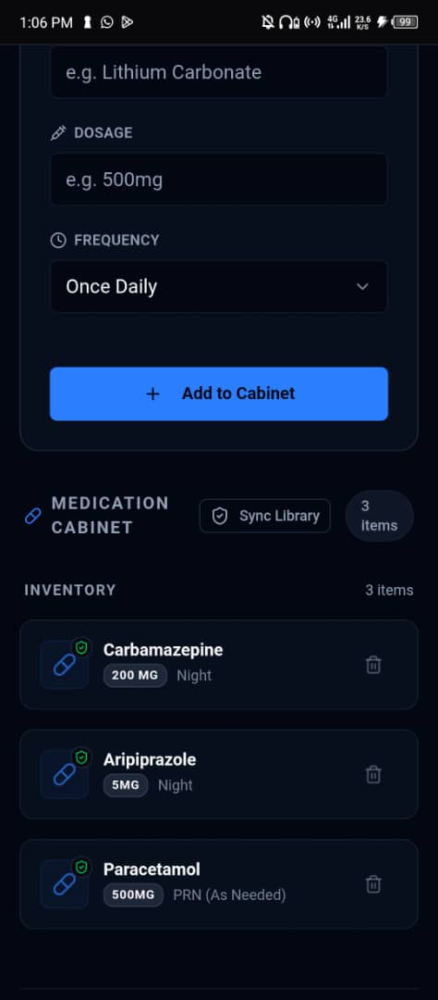
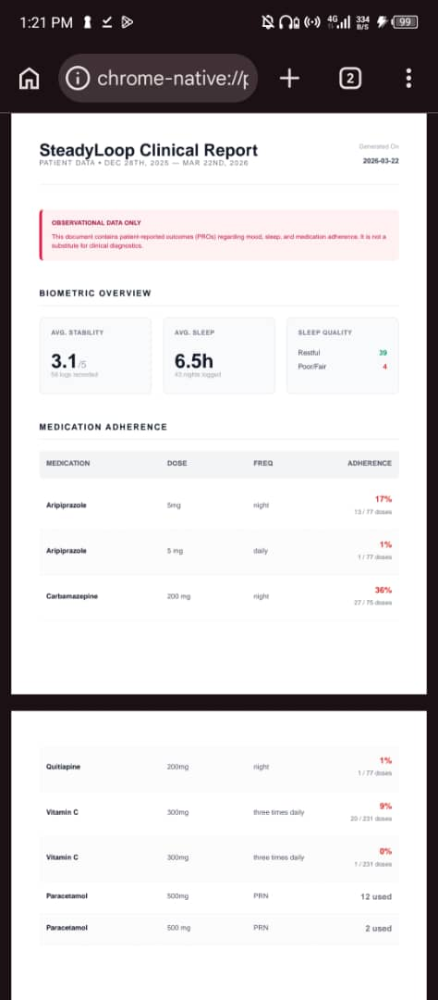
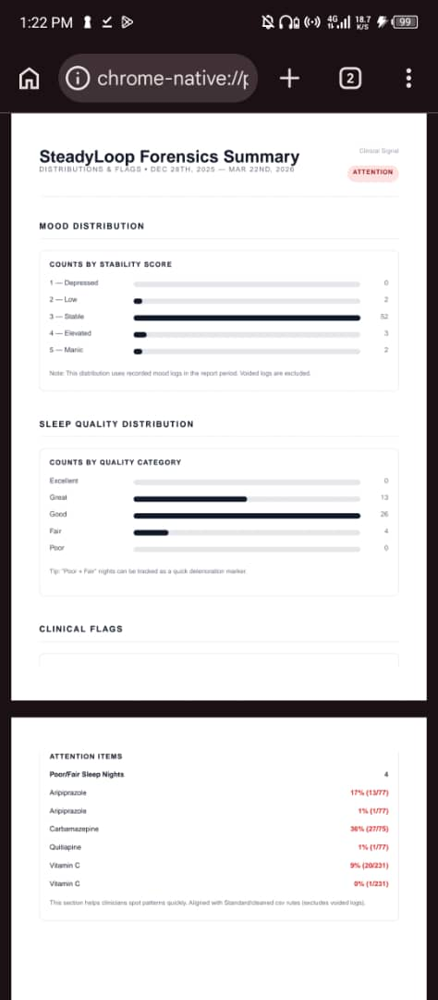

# SteadyLoop
### A Privacy-First Mood Tracking PWA for Bipolar Disorder

> "Building quiet tools for loud minds."

---

## The Problem

Mental health apps often suffer from feature bloat and friction. For individuals managing bipolar disorder, logging critical health data needs to happen in under 5 seconds—especially during high-stress episodes when adherence is most challenging.

## The Solution

SteadyLoop is a Progressive Web App designed specifically for stability tracking in Bipolar Type 1 & 2. It prioritizes **speed, privacy, and clinical alignment** over social features or gamification.

### Core Features

- **Clinical Scale Integration:** Industry-standard metrics mapped for provider review
- **7-Day Trend Visualization:** Pattern recognition for baseline shifts
- **Smart Medication Cabinet:** Complex dosing schedules with offline support
- **Complete Data Sovereignty:** One-click account deletion, zero data retention
- **Native PWA Experience:** Installs to home screen, works offline
- **Clinically Aligned Exports:** Clinically aligned grade exports

---

## Design Philosophy

**Zero Friction:** Every interaction optimized for sub-5-second completion  
**Privacy-First:** Strict data isolation, no analytics, no third-party tracking  
**Clinically Aligned:** Built for real care provider collaboration  

---

## Tech Highlights

- Modern React-based framework with TypeScript
- PostgreSQL backend with row-level security
- Offline-first architecture with smart synchronization
- Edge-deployed for global low-latency access
- Dark mode default with accessibility compliance

---

## Screenshots

### Dashboard

### Clinical Logs

### Retroactive Logging

### Medication Cabinet

### Clinical Report — Adherence

### Clinical Report — Forensics Summary

---
## Changelog

### v0.9.0 — March 2026

**Clinical Reports**
- Fixed archived medication blind spot — meds removed from cabinet now appear correctly in adherence tables
- Corrected sleep quality classification — Good nights now count as Restful in clinical summary
- Fixed PRN dose undercounting — multi-dose days now counted correctly
- Fixed Aripiprazole adherence numerator off-by-one

**Data Pipeline**
- Refactored server actions to REST route handlers for reliable TanStack Query cache invalidation
- Split queries into server/client modules — fixes mobile PWA SSR errors
- Normalised medication action casing — DB was silently missing logs

**Retroactive Logging**
- 7-day backdating window for sleep and medication logs
- BACKDATED amber tag on all retroactive entries in logs timeline
- Server-side validation — event date required, strictly limited to 7 days
- Duplicate prevention — already-logged dates blocked in modal
- Retroactive logs excluded from daily checklist and active sleep widget

**Dashboard**
- Persistent Clinical Logs button — sticky mobile bottom bar and desktop sidebar
- Split header — sticky top bar on mobile/tablet, compact sidebar header on desktop
- Removed unnecessary isMounted pattern from sleep widget
- Fixed sleep widget showing unlogged when retroactive logs present

**Logs Page**
- Compact mobile header — 4 rows of controls reduced to 2
- Week navigation collapsed to chevron buttons on mobile
- Log Past Entry reduced to icon-only on mobile

**Bug Fixes**
- Fixed daily checklist showing retroactive logs as today's entries
- Fixed IDB store SSR crash — lazy initialisation with window guard
- Replaced isMounted/useEffect pattern in MedicationChecklist with module-level constant
- Fixed sleep log form breaking when log_type is null
- Fixed medication logging rejecting valid entries due to null log_type

---

## Roadmap

**Current:** v0.9.0 (Closed Beta)

**Planned:**
- Crisis intervention protocols (in design - intentionally staged)
- Push notifications
- Biometric authentication
- Wearable sleep data integration
- Centralised timezone handling
- Medication regime duration tracking (start/end dates)
- Insight cards — mood/medication correlation analysis

---

## About This Project

Built by Timothy Finomo as a solo product architect addressing a personal need for better mental health tooling.

**Note:** SteadyLoop is a data logging tool, not a medical device. It does not provide medical advice, diagnosis, or treatment.

---

**Live Demo:** [steady-loop-beta.vercel.app](https://steady-loop-beta.vercel.app)  
**Contact:** [LinkedIn](https://www.linkedin.com/in/timothy-finomo-522bb1241/)

---

© 2025 Timothy Finomo. All Rights Reserved.
